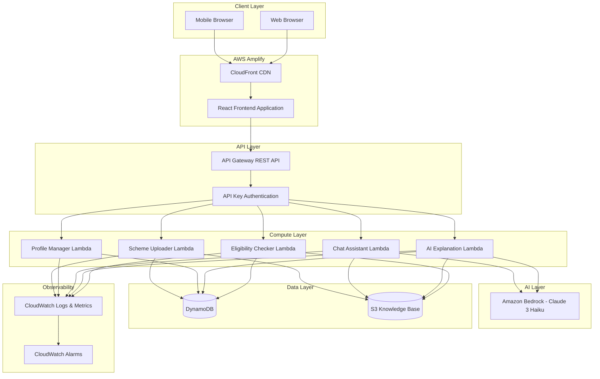
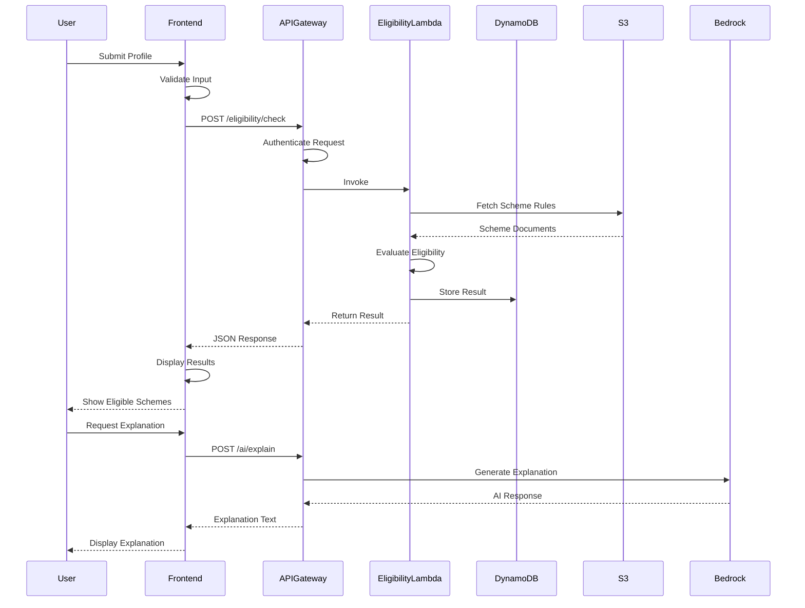
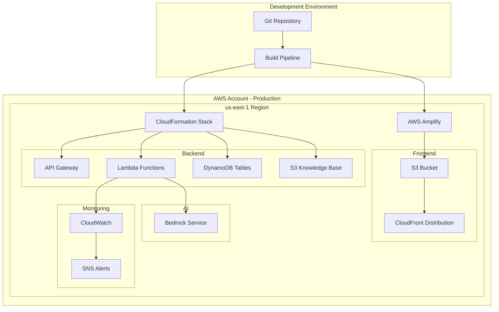

# Technical Design Document: NEXIS Full-Stack Transformation

## Overview

### Purpose

This document provides the comprehensive technical design for transforming NEXIS (National Eligibility eXplorer and Information System) from a frontend prototype into a production-ready full-stack application. NEXIS is an AI-powered civic-tech platform that helps Indian citizens understand and access government welfare schemes through intelligent eligibility checking and conversational AI assistance.

### System Context

NEXIS serves rural citizens, elderly users with low digital literacy, Common Service Center (CSC) operators, and mobile users on slow internet connections. The system must be accessible, performant on 3G networks, and provide accurate, trustworthy information about government welfare schemes.

### Design Goals

1. **Scalability**: Handle 1000+ concurrent users with serverless auto-scaling
2. **Performance**: Sub-3-second eligibility checks, sub-7-second AI responses
3. **Reliability**: 99.9% uptime with automated error recovery
4. **Security**: End-to-end encryption, least-privilege access, input validation
5. **Cost-Efficiency**: Serverless architecture with pay-per-use pricing
6. **Maintainability**: Clean architecture with separation of concerns
7. **Accessibility**: WCAG AA compliance, mobile-first responsive design

### Technology Stack

**Frontend**:
- React 18 with functional components and hooks
- React Router for navigation
- Axios for API communication
- Tailwind CSS for styling
- Vite for build tooling

**Backend**:
- AWS Lambda (Node.js 18.x runtime)
- Amazon API Gateway (REST API)
- Amazon DynamoDB (NoSQL database)
- Amazon S3 (Knowledge Base storage)
- Amazon Bedrock (Claude 3 Haiku for AI)

**Infrastructure**:
- AWS Amplify (frontend hosting and CI/CD)
- AWS CloudFormation (infrastructure as code)
- Amazon CloudWatch (monitoring and logging)
- AWS IAM (authentication and authorization)

**Development**:
- TypeScript for type safety
- Jest and React Testing Library for unit tests
- fast-check for property-based testing
- ESLint and Prettier for code quality

## Architecture

### High-Level System Architecture



### Data Flow Architecture



### Deployment Architecture



## Components and Interfaces

### Frontend Components

#### Component Hierarchy

```
App
├── Router
│   ├── LandingPage
│   ├── LanguageSelectionPage
│   ├── ProfileFormPage
│   │   ├── ProfileForm
│   │   │   ├── AgeInput
│   │   │   ├── StateSelector
│   │   │   ├── OccupationSelector
│   │   │   ├── IncomeInput
│   │   │   ├── GenderSelector
│   │   │   ├── SocialCategorySelector
│   │   │   └── DisabilityCheckbox
│   │   └── ValidationErrors
│   ├── EligibilityDashboardPage
│   │   ├── EligibleSchemesList
│   │   │   └── SchemeCard
│   │   ├── IneligibleSchemesList
│   │   │   └── SchemeCard
│   │   └── SchemeDetailModal
│   │       ├── SchemeInfo
│   │       ├── EligibilityReasons
│   │       └── ExplanationPanel
│   └── AIAssistantPage
│       ├── ChatInterface
│       │   ├── MessageList
│       │   │   └── Message
│       │   └── ChatInput
│       └── ConversationContext
├── Layout
│   ├── Header
│   │   ├── Logo
│   │   └── LanguageToggle
│   ├── Navigation
│   └── Footer
├── ErrorBoundary
└── LoadingSpinner
```

#### Key Component Specifications

**ProfileForm Component**
- Purpose: Collect user demographic information
- Props: `onSubmit: (profile: UserProfile) => void`, `initialValues?: Partial<UserProfile>`
- State: Form field values, validation errors, submission status
- Validation: Client-side validation before API submission
- Accessibility: ARIA labels, keyboard navigation, error announcements

**SchemeCard Component**
- Purpose: Display scheme summary with eligibility status
- Props: `scheme: Scheme`, `eligibilityStatus: 'eligible' | 'ineligible'`, `onClick: () => void`
- Visual: Color-coded border (green for eligible, gray for ineligible)
- Accessibility: Semantic HTML, screen reader friendly

**ChatInterface Component**
- Purpose: Conversational AI assistant for scheme queries
- Props: `userProfile: UserProfile`, `sessionId: string`
- State: Message history, input text, loading state
- Features: Context-aware responses, conversation history, typing indicators

### Frontend Service Layer

#### API Client Service

```typescript
// services/api/apiClient.ts
interface APIClient {
  checkEligibility(profile: UserProfile): Promise<EligibilityResult>;
  getExplanation(schemeId: string, resultId: string): Promise<string>;
  sendChatMessage(message: string, sessionId: string): Promise<ChatResponse>;
  saveProfile(profile: UserProfile): Promise<ProfileSaveResponse>;
  getSchemeDetails(schemeId: string): Promise<SchemeDetails>;
}
```

**Implementation Details**:
- Base URL configuration from environment variables
- Axios instance with interceptors for authentication
- Request/response logging for debugging
- Error handling with user-friendly messages
- Retry logic for transient failures (3 retries with exponential backoff)
- Request timeout: 30 seconds

#### Storage Service

```typescript
// services/storage/localStorage.ts
interface StorageService {
  saveProfile(profile: UserProfile): void;
  getProfile(): UserProfile | null;
  saveLanguage(language: 'en' | 'hi'): void;
  getLanguage(): 'en' | 'hi';
  cacheEligibilityResult(result: EligibilityResult): void;
  getCachedResult(): EligibilityResult | null;
  clearCache(): void;
}
```

### Backend Lambda Functions

#### 1. Eligibility Checker Lambda

**Function Name**: `nexis-eligibility-checker`

**Purpose**: Evaluate user eligibility against all government schemes

**Runtime**: Node.js 18.x

**Memory**: 1024 MB

**Timeout**: 30 seconds

**Environment Variables**:
- `SCHEMES_BUCKET`: S3 bucket name for scheme documents
- `RESULTS_TABLE`: DynamoDB table name for eligibility results
- `LOG_LEVEL`: Logging verbosity (INFO, DEBUG, ERROR)

**Input Schema**:
```json
{
  "userId": "string (optional)",
  "profile": {
    "age": "number (0-120)",
    "state": "string (Indian state code)",
    "occupation": "string (occupation category)",
    "annualIncome": "number (INR)",
    "gender": "string (Male|Female|Other)",
    "socialCategory": "string (General|OBC|SC|ST)",
    "hasDisability": "boolean"
  }
}
```

**Output Schema**:
```json
{
  "resultId": "string (UUID)",
  "timestamp": "string (ISO 8601)",
  "eligibleSchemes": [
    {
      "schemeId": "string",
      "schemeName": "string",
      "description": "string",
      "benefits": "string",
      "satisfiedCriteria": ["string"],
      "matchScore": "number (0-100)"
    }
  ],
  "ineligibleSchemes": [
    {
      "schemeId": "string",
      "schemeName": "string",
      "description": "string",
      "unsatisfiedCriteria": [
        {
          "criterion": "string",
          "reason": "string"
        }
      ]
    }
  ],
  "totalSchemes": "number"
}
```

**Processing Logic**:
1. Validate input profile against schema
2. Fetch all scheme documents from S3
3. For each scheme:
   - Evaluate age criteria
   - Evaluate income criteria
   - Evaluate state criteria
   - Evaluate occupation criteria
   - Evaluate social category criteria
   - Evaluate disability criteria
4. Calculate match score for eligible schemes
5. Sort eligible schemes by match score (descending)
6. Store result in DynamoDB with TTL
7. Return formatted response

**Error Handling**:
- Invalid input: Return 400 with validation errors
- S3 fetch failure: Return 503 with retry message
- DynamoDB write failure: Log error but return result (non-blocking)
- Timeout: Return 504 with partial results if available

#### 2. AI Explanation Lambda

**Function Name**: `nexis-ai-explanation`

**Purpose**: Generate plain-language explanations of eligibility decisions

**Runtime**: Node.js 18.x

**Memory**: 512 MB

**Timeout**: 30 seconds

**Environment Variables**:
- `BEDROCK_MODEL_ID`: `anthropic.claude-3-haiku-20240307-v1:0`
- `BEDROCK_REGION`: `us-east-1`
- `RESULTS_TABLE`: DynamoDB table name
- `SCHEMES_BUCKET`: S3 bucket name

**Input Schema**:
```json
{
  "resultId": "string (UUID)",
  "schemeId": "string",
  "language": "string (en|hi)"
}
```

**Output Schema**:
```json
{
  "explanation": "string (plain-language text)",
  "alternativeSchemes": ["string (scheme IDs)"],
  "generatedAt": "string (ISO 8601)"
}
```

**Prompt Template**:
```
You are a helpful assistant explaining government welfare scheme eligibility to citizens with low digital literacy.

User Profile:
- Age: {age}
- State: {state}
- Occupation: {occupation}
- Annual Income: ₹{income}
- Gender: {gender}
- Social Category: {category}
- Has Disability: {disability}

Scheme: {schemeName}
Description: {schemeDescription}

Eligibility Status: {eligible/ineligible}

{if eligible}
Satisfied Criteria: {criteria_list}

Explain in simple {language} why this user qualifies for this scheme. Use everyday language, avoid jargon, and be encouraging.
{endif}

{if ineligible}
Unsatisfied Criteria: {criteria_list}

Explain in simple {language} why this user does not qualify for this scheme. Be empathetic and suggest what would need to change for them to qualify. If there are similar schemes they might qualify for, mention them.
{endif}

Keep the explanation under 150 words. Use short sentences.
```

**Processing Logic**:
1. Fetch eligibility result from DynamoDB
2. Fetch scheme details from S3
3. Build prompt with user profile and scheme criteria
4. Call Bedrock API with prompt
5. Parse and validate AI response
6. Identify alternative schemes if ineligible
7. Return formatted explanation

**Caching Strategy**:
- Cache explanations in DynamoDB with composite key (resultId + schemeId + language)
- TTL: 7 days
- Check cache before calling Bedrock to reduce costs

#### 3. Chat Assistant Lambda

**Function Name**: `nexis-chat-assistant`

**Purpose**: Conversational AI for scheme-related queries using RAG

**Runtime**: Node.js 18.x

**Memory**: 1024 MB

**Timeout**: 30 seconds

**Environment Variables**:
- `BEDROCK_MODEL_ID`: `anthropic.claude-3-haiku-20240307-v1:0`
- `KNOWLEDGE_BASE_BUCKET`: S3 bucket name
- `SESSIONS_TABLE`: DynamoDB table for conversation history
- `MAX_CONTEXT_MESSAGES`: `10`

**Input Schema**:
```json
{
  "sessionId": "string (UUID)",
  "message": "string (user query)",
  "userProfile": {
    "age": "number",
    "state": "string",
    "occupation": "string",
    "annualIncome": "number",
    "gender": "string",
    "socialCategory": "string",
    "hasDisability": "boolean"
  },
  "language": "string (en|hi)"
}
```

**Output Schema**:
```json
{
  "response": "string (AI response)",
  "sources": ["string (document references)"],
  "confidence": "string (high|medium|low)",
  "followUpSuggestions": ["string"]
}
```

**RAG Workflow**:
1. Sanitize user query
2. Retrieve conversation history from DynamoDB (last 10 messages)
3. Extract keywords from query
4. Search S3 Knowledge Base for relevant documents
5. Rank documents by relevance
6. Select top 3 documents
7. Build context with user profile + conversation history + retrieved documents
8. Generate prompt for Bedrock
9. Call Bedrock API
10. Parse response and extract confidence level
11. Store message in conversation history
12. Return response with sources

**Prompt Template**:
```
You are NEXIS, an AI assistant helping Indian citizens understand government welfare schemes.

User Context:
- Age: {age}, State: {state}, Occupation: {occupation}
- Income: ₹{income}, Category: {category}

Conversation History:
{previous_messages}

Retrieved Documents:
{document_1}
{document_2}
{document_3}

User Question: {user_query}

Instructions:
1. Answer in simple {language} suitable for users with low digital literacy
2. Base your answer ONLY on the retrieved documents
3. If the documents don't contain the answer, say "I don't have that information"
4. Do NOT make promises about scheme approval or benefit amounts
5. Do NOT provide medical, legal, or financial advice
6. Keep responses under 200 words
7. Use short sentences and everyday language

Response:
```

**Document Retrieval Strategy**:
- S3 bucket structure: `schemes/{scheme-id}/policy.txt`, `schemes/{scheme-id}/faq.txt`
- Simple keyword matching (future: vector embeddings)
- Relevance scoring based on keyword frequency and document metadata

#### 4. Profile Manager Lambda

**Function Name**: `nexis-profile-manager`

**Purpose**: CRUD operations for user profiles

**Runtime**: Node.js 18.x

**Memory**: 512 MB

**Timeout**: 10 seconds

**Endpoints**:
- `POST /profiles` - Create profile
- `GET /profiles/{userId}` - Retrieve profile
- `PUT /profiles/{userId}` - Update profile
- `DELETE /profiles/{userId}` - Delete profile

**Input Schema (POST/PUT)**:
```json
{
  "profile": {
    "age": "number (0-120)",
    "state": "string",
    "occupation": "string",
    "annualIncome": "number",
    "gender": "string",
    "socialCategory": "string",
    "hasDisability": "boolean"
  }
}
```

**Processing Logic**:
- Validate all inputs against schema
- Encrypt sensitive fields before storage
- Generate unique userId (UUID v4)
- Store in DynamoDB Users table
- Return userId and confirmation

#### 5. Scheme Uploader Lambda

**Function Name**: `nexis-scheme-uploader`

**Purpose**: Upload and validate scheme documents for Knowledge Base

**Runtime**: Node.js 18.x

**Memory**: 512 MB

**Timeout**: 60 seconds

**Input Schema**:
```json
{
  "schemeId": "string",
  "schemeName": "string",
  "description": "string",
  "benefits": "string",
  "eligibilityCriteria": {
    "ageMin": "number (optional)",
    "ageMax": "number (optional)",
    "incomeMax": "number (optional)",
    "states": ["string (optional)"],
    "occupations": ["string (optional)"],
    "socialCategories": ["string (optional)"],
    "requiresDisability": "boolean (optional)"
  },
  "policyDocument": "string (text content)",
  "faqDocument": "string (text content)"
}
```

**Validation Rules**:
- schemeId: alphanumeric with hyphens, max 50 chars
- schemeName: required, max 200 chars
- description: required, max 1000 chars
- ageMin/ageMax: 0-120, ageMin < ageMax
- incomeMax: positive number
- states: valid Indian state codes
- policyDocument: required, max 50KB
- faqDocument: optional, max 50KB

**Processing Logic**:
1. Validate input against JSON schema
2. Parse eligibility criteria
3. Validate criteria ranges and values
4. Upload policy document to S3: `schemes/{schemeId}/policy.txt`
5. Upload FAQ document to S3: `schemes/{schemeId}/faq.txt`
6. Store scheme metadata in DynamoDB Schemes table
7. Update search index
8. Return success confirmation

**Round-Trip Property**:
- For all valid scheme documents: `parse(print(parse(doc))) == parse(doc)`
- Implemented in property-based tests

## Data Models

### DynamoDB Table Schemas

#### Users Table

**Table Name**: `nexis-users`

**Partition Key**: `userId` (String)

**Attributes**:
```json
{
  "userId": "string (UUID)",
  "profile": {
    "age": "number",
    "state": "string",
    "occupation": "string",
    "annualIncome": "number",
    "gender": "string",
    "socialCategory": "string",
    "hasDisability": "boolean"
  },
  "createdAt": "string (ISO 8601)",
  "updatedAt": "string (ISO 8601)",
  "language": "string (en|hi)"
}
```

**Encryption**: Server-side encryption enabled (SSE-KMS)

**TTL**: None (user data persists until deletion request)

**Capacity Mode**: On-demand

#### EligibilityResults Table

**Table Name**: `nexis-eligibility-results`

**Partition Key**: `resultId` (String)

**Sort Key**: `timestamp` (String)

**GSI 1**: `userId-timestamp-index`
- Partition Key: `userId`
- Sort Key: `timestamp`
- Purpose: Query all results for a user

**Attributes**:
```json
{
  "resultId": "string (UUID)",
  "userId": "string (UUID, optional)",
  "timestamp": "string (ISO 8601)",
  "profile": {
    "age": "number",
    "state": "string",
    "occupation": "string",
    "annualIncome": "number",
    "gender": "string",
    "socialCategory": "string",
    "hasDisability": "boolean"
  },
  "eligibleSchemes": [
    {
      "schemeId": "string",
      "schemeName": "string",
      "matchScore": "number"
    }
  ],
  "ineligibleSchemes": [
    {
      "schemeId": "string",
      "schemeName": "string"
    }
  ],
  "totalSchemes": "number",
  "ttl": "number (Unix timestamp)"
}
```

**TTL Attribute**: `ttl` (90 days from creation)

**Capacity Mode**: On-demand

#### UserSessions Table

**Table Name**: `nexis-user-sessions`

**Partition Key**: `sessionId` (String)

**Attributes**:
```json
{
  "sessionId": "string (UUID)",
  "userId": "string (UUID, optional)",
  "conversationHistory": [
    {
      "role": "string (user|assistant)",
      "message": "string",
      "timestamp": "string (ISO 8601)"
    }
  ],
  "createdAt": "string (ISO 8601)",
  "lastActivity": "string (ISO 8601)",
  "ttl": "number (Unix timestamp)"
}
```

**TTL Attribute**: `ttl` (90 days from last activity)

**Capacity Mode**: On-demand

#### Schemes Table

**Table Name**: `nexis-schemes`

**Partition Key**: `schemeId` (String)

**GSI 1**: `state-index`
- Partition Key: `state`
- Purpose: Query schemes by state

**Attributes**:
```json
{
  "schemeId": "string",
  "schemeName": "string",
  "description": "string",
  "benefits": "string",
  "eligibilityCriteria": {
    "ageMin": "number",
    "ageMax": "number",
    "incomeMax": "number",
    "states": ["string"],
    "occupations": ["string"],
    "socialCategories": ["string"],
    "requiresDisability": "boolean"
  },
  "s3PolicyPath": "string",
  "s3FaqPath": "string",
  "createdAt": "string (ISO 8601)",
  "updatedAt": "string (ISO 8601)",
  "version": "number"
}
```

**Capacity Mode**: On-demand

#### ExplanationCache Table

**Table Name**: `nexis-explanation-cache`

**Partition Key**: `cacheKey` (String) - Format: `{resultId}#{schemeId}#{language}`

**Attributes**:
```json
{
  "cacheKey": "string",
  "explanation": "string",
  "alternativeSchemes": ["string"],
  "generatedAt": "string (ISO 8601)",
  "ttl": "number (Unix timestamp)"
}
```

**TTL Attribute**: `ttl` (7 days from generation)

**Capacity Mode**: On-demand

### S3 Bucket Structure

**Bucket Name**: `nexis-knowledge-base-{environment}`

**Directory Structure**:
```
schemes/
├── scheme-001/
│   ├── policy.txt
│   ├── faq.txt
│   └── metadata.json
├── scheme-002/
│   ├── policy.txt
│   ├── faq.txt
│   └── metadata.json
└── ...

templates/
├── explanation-prompt-en.txt
├── explanation-prompt-hi.txt
├── chat-prompt-en.txt
└── chat-prompt-hi.txt

indexes/
└── scheme-keywords.json
```

**Lifecycle Policy**:
- Transition to S3 Intelligent-Tiering after 30 days
- Archive to Glacier after 180 days (for old versions)

**Versioning**: Enabled

**Encryption**: SSE-S3

**Access**: Private (Lambda functions only via IAM roles)

### Data Access Patterns

**Pattern 1: Check Eligibility**
- Query: Scan Schemes table (or use cached scheme list)
- Write: Put item in EligibilityResults table
- Frequency: High (primary use case)
- Optimization: Cache scheme list in Lambda memory

**Pattern 2: Get User Results History**
- Query: Query EligibilityResults table using GSI `userId-timestamp-index`
- Frequency: Medium
- Optimization: Limit to last 10 results

**Pattern 3: Get Scheme Details**
- Query: GetItem from Schemes table by schemeId
- Read: Fetch policy document from S3
- Frequency: Medium
- Optimization: Cache frequently accessed schemes

**Pattern 4: Chat Conversation**
- Query: GetItem from UserSessions table by sessionId
- Write: UpdateItem to append message to conversationHistory
- Frequency: High during chat sessions
- Optimization: Limit conversation history to last 10 messages

**Pattern 5: Explanation Generation**
- Query: GetItem from ExplanationCache table
- If miss: Generate and PutItem
- Frequency: Medium
- Optimization: 7-day cache TTL

## Correctness Properties

*A property is a characteristic or behavior that should hold true across all valid executions of a system—essentially, a formal statement about what the system should do. Properties serve as the bridge between human-readable specifications and machine-verifiable correctness guarantees.*


### Property Reflection

After analyzing all acceptance criteria, I identified the following testable properties. Now I'll eliminate redundancy:

**Redundancy Analysis**:

1. **Eligibility Engine Properties**: Requirements 3.1, 3.7, 20.1, 20.2 all relate to completeness of scheme evaluation. These can be combined into a single comprehensive property about evaluating all schemes exactly once.

2. **Criterion Evaluation**: Requirements 3.8, 3.9, 3.10, 20.6, 20.7 all test specific criterion types (age, income, state). These can be combined into properties about criterion satisfaction logic.

3. **Eligibility Logic**: Requirements 20.3 and 20.4 are complementary (eligible when all satisfied, ineligible when any fails) and can be combined into a single property about eligibility determination.

4. **Input Validation**: Requirements 2.1-2.7, 2.8, 2.9, 11.1, 11.4, 11.5, 11.7 all relate to input validation. These can be consolidated into properties about validation rules.

5. **AI Safety**: Requirements 5.7, 5.9, 6.9, 6.10, 21.1, 21.2, 21.3 all relate to AI response safety. These can be combined into properties about AI output constraints.

6. **Response Structure**: Requirements 3.2, 3.3, 9.10 all relate to response format consistency.

**Consolidated Properties** (after removing redundancy):

- Eligibility completeness and uniqueness (combines 3.1, 3.7, 20.1, 20.2, 20.5)
- Eligibility determination logic (combines 20.3, 20.4, 20.9)
- Criterion evaluation correctness (combines 3.8, 3.9, 3.10, 20.6, 20.7)
- Criterion independence (20.8 - unique)
- Idempotence (20.10 - unique)
- Input validation (combines 2.1-2.9, 11.1-11.7)
- Scheme parser round-trip (
**Consolidated Properties** (after removing redundancy):

- Eligibility completeness and uniqueness (combines 3.1, 3.7, 20.1, 20.2, 20.5)
- Eligibility determination logic (combines 20.3, 20.4, 20.9)
- Criterion evaluation correctness (combines 3.8, 3.9, 3.10, 20.6, 20.7)
- Criterion independence (20.8 - unique)
- Idempotence (20.10 - unique)
- Input validation (combines 2.1-2.9, 11.1-11.7)
- Scheme parser round-trip (18.6 - unique)
- AI response safety (combines 5.7, 5.9, 6.9, 6.10, 21.1-21.5)
- Response structure consistency (combines 3.2, 3.3, 9.10)
- Performance bounds (combines 3.4, 5.6, 6.5, 13.5-13.7)

### Formal Property Specifications

#### Property 1: Eligibility Completeness and Uniqueness

**Statement**: For all valid User_Profiles and all Scheme databases, the Eligibility_Engine SHALL evaluate every Scheme exactly once, and no Scheme SHALL appear in both eligible and ineligible lists.

**Formal Expression**:
```
∀ profile ∈ UserProfile, ∀ schemes ∈ SchemeDatabase:
  let result = checkEligibility(profile, schemes)
  
  // Completeness
  |result.eligibleSchemes| + |result.ineligibleSchemes| = |schemes|
  
  // Uniqueness
  result.eligibleSchemes ∩ result.ineligibleSchemes = ∅
  
  // No duplicates
  |result.eligibleSchemes| = |unique(result.eligibleSchemes)|
  |result.ineligibleSchemes| = |unique(result.ineligibleSchemes)|
```

**Test Strategy**: Property-based testing with fast-check
- Generate random User_Profiles
- Generate random Scheme databases (1-100 schemes)
- Verify completeness and uniqueness invariants
- Run 1000 test cases

**Implementation Location**: `backend/tests/properties/eligibility.test.ts`

#### Property 2: Eligibility Determination Logic

**Statement**: For all Schemes, a User_Profile is eligible if and only if ALL eligibility criteria are satisfied. If ANY criterion is unsatisfied, the Scheme SHALL be ineligible.

**Formal Expression**:
```
∀ profile ∈ UserProfile, ∀ scheme ∈ Scheme:
  let criteria = scheme.eligibilityCriteria
  let satisfied = evaluateCriteria(profile, criteria)
  
  isEligible(profile, scheme) ⟺ ∀c ∈ criteria: satisfied(c) = true
  
  isIneligible(profile, scheme) ⟺ ∃c ∈ criteria: satisfied(c) = false
```

**Test Strategy**: Property-based testing
- Generate schemes with 1-6 criteria
- Generate profiles that satisfy 0 to all criteria
- Verify eligibility determination matches criterion satisfaction
- Test edge cases: empty criteria, all criteria satisfied, one criterion failed

**Implementation Location**: `backend/tests/properties/eligibility.test.ts`

#### Property 3: Criterion Evaluation Correctness

**Statement**: For all criterion types (age, income, state, occupation, social category, disability), the evaluation function SHALL correctly determine satisfaction based on User_Profile attributes and Scheme requirements.

**Formal Expression**:
```
// Age criterion
∀ profile, scheme:
  hasAgeCriterion(scheme) ⟹
    satisfiesAge(profile, scheme) ⟺ 
      scheme.ageMin ≤ profile.age ≤ scheme.ageMax

// Income criterion
∀ profile, scheme:
  hasIncomeCriterion(scheme) ⟹
    satisfiesIncome(profile, scheme) ⟺ 
      profile.annualIncome ≤ scheme.incomeMax

// State criterion
∀ profile, scheme:
  hasStateCriterion(scheme) ⟹
    satisfiesState(profile, scheme) ⟺ 
      profile.state ∈ scheme.states
```

**Test Strategy**: Property-based testing with boundary analysis
- Test age boundaries: ageMin-1, ageMin, ageMax, ageMax+1
- Test income boundaries: incomeMax-1, incomeMax, incomeMax+1
- Test state membership: included states, excluded states
- Generate 500 test cases per criterion type

**Implementation Location**: `backend/tests/properties/criteria.test.ts`

#### Property 4: Criterion Independence

**Statement**: For all User_Profiles and Schemes, changing a User_Profile attribute that is NOT used by a Scheme's eligibility criteria SHALL NOT change the eligibility result for that Scheme.

**Formal Expression**:
```
∀ profile1, profile2 ∈ UserProfile, ∀ scheme ∈ Scheme:
  let usedAttrs = getUsedAttributes(scheme.criteria)
  let unchangedAttrs = {attr | attr ∈ profile1, attr ∉ usedAttrs}
  
  (∀ attr ∈ usedAttrs: profile1[attr] = profile2[attr]) ⟹
    isEligible(profile1, scheme) = isEligible(profile2, scheme)
```

**Test Strategy**: Property-based testing
- Generate scheme with subset of criteria (e.g., only age and income)
- Generate two profiles identical in used attributes, different in unused
- Verify eligibility result is identical
- Test all combinations of criterion subsets

**Implementation Location**: `backend/tests/properties/independence.test.ts`

#### Property 5: Idempotence

**Statement**: For all User_Profiles, calling checkEligibility multiple times with the same profile SHALL produce equivalent results (within the same Scheme database state).

**Formal Expression**:
```
∀ profile ∈ UserProfile:
  let result1 = checkEligibility(profile)
  let result2 = checkEligibility(profile)
  
  result1.eligibleSchemes = result2.eligibleSchemes ∧
  result1.ineligibleSchemes = result2.ineligibleSchemes
```

**Test Strategy**: Property-based testing
- Generate random profiles
- Call checkEligibility twice
- Verify results are identical (deep equality)
- Run 500 test cases

**Implementation Location**: `backend/tests/properties/idempotence.test.ts`

#### Property 6: Input Validation

**Statement**: For all API endpoints, invalid inputs SHALL be rejected with HTTP 400 status and specific validation error messages. Valid inputs SHALL be accepted and processed.

**Formal Expression**:
```
∀ input ∈ APIInput:
  isValid(input) ⟹ statusCode(process(input)) ∈ {200, 201}
  ¬isValid(input) ⟹ statusCode(process(input)) = 400 ∧
                     hasValidationErrors(response(input))

// Validation rules
isValid(profile) ⟺
  0 ≤ profile.age ≤ 120 ∧
  profile.state ∈ VALID_STATES ∧
  profile.occupation ∈ VALID_OCCUPATIONS ∧
  profile.annualIncome ≥ 0 ∧
  profile.gender ∈ {Male, Female, Other} ∧
  profile.socialCategory ∈ {General, OBC, SC, ST} ∧
  typeof(profile.hasDisability) = boolean
```

**Test Strategy**: Property-based testing with invalid input generation
- Generate profiles with out-of-range age
- Generate profiles with invalid state codes
- Generate profiles with negative income
- Verify 400 status and error messages
- Run 200 test cases per validation rule

**Implementation Location**: `backend/tests/properties/validation.test.ts`

#### Property 7: Scheme Parser Round-Trip

**Statement**: For all valid Scheme documents, parsing, then printing, then parsing again SHALL produce an equivalent document.

**Formal Expression**:
```
∀ doc ∈ ValidSchemeDocument:
  let parsed1 = parse(doc)
  let printed = print(parsed1)
  let parsed2 = parse(printed)
  
  parsed1 ≡ parsed2
```

**Test Strategy**: Property-based testing
- Generate random valid scheme documents
- Apply parse → print → parse transformation
- Verify structural equivalence
- Test with various criterion combinations
- Run 500 test cases

**Implementation Location**: `backend/tests/properties/parser.test.ts`

#### Property 8: AI Response Safety

**Statement**: For all AI-generated responses (explanations and chat), the content SHALL NOT contradict scheme rules, SHALL NOT promise approval, and SHALL only reference information from the Knowledge Base.

**Formal Expression**:
```
∀ response ∈ AIResponse:
  // No contradictions
  ∀ statement ∈ extract(response):
    ¬contradicts(statement, schemeRules)
  
  // No approval promises
  ¬contains(response, APPROVAL_KEYWORDS)
  
  // Only KB information
  ∀ fact ∈ extractFacts(response):
    ∃ doc ∈ KnowledgeBase: contains(doc, fact)
```

**Test Strategy**: Integration testing with content analysis
- Generate explanations for eligible/ineligible schemes
- Parse response for contradiction keywords
- Check for approval promise patterns
- Verify all facts are traceable to KB documents
- Manual review of 100 sample responses

**Implementation Location**: `backend/tests/integration/ai-safety.test.ts`

#### Property 9: Response Structure Consistency

**Statement**: For all API endpoints, responses SHALL follow a consistent structure with status code, data/error object, and timestamp.

**Formal Expression**:
```
∀ endpoint ∈ APIEndpoints, ∀ request ∈ ValidRequests:
  let response = endpoint(request)
  
  hasField(response, "statusCode") ∧
  hasField(response, "timestamp") ∧
  (hasField(response, "data") ⊕ hasField(response, "error"))
```

**Test Strategy**: Integration testing
- Call all API endpoints with valid requests
- Verify response structure
- Test error scenarios
- Run 50 test cases per endpoint

**Implementation Location**: `backend/tests/integration/api-structure.test.ts`

#### Property 10: Performance Bounds

**Statement**: For all operations, response times SHALL be within specified bounds under normal load conditions.

**Formal Expression**:
```
∀ profile ∈ UserProfile:
  responseTime(checkEligibility(profile)) ≤ 3000ms
  
∀ explanation ∈ ExplanationRequest:
  responseTime(generateExplanation(explanation)) ≤ 5000ms
  
∀ query ∈ ChatQuery:
  responseTime(chatAssistant(query)) ≤ 7000ms
```

**Test Strategy**: Performance testing
- Run eligibility checks with 100 schemes
- Measure response times under load (100 concurrent users)
- Verify 95th percentile meets bounds
- Run 1000 iterations per operation type

**Implementation Location**: `backend/tests/performance/response-times.test.ts`

## Security Architecture

### Authentication and Authorization

**API Gateway Authentication**:
- API Key authentication for all endpoints
- API keys stored in AWS Secrets Manager
- Key rotation every 90 days
- Rate limiting: 100 requests/minute per key

**Lambda IAM Roles**:
- Separate IAM role per Lambda function
- Least privilege principle
- Policies:
  - Eligibility Checker: Read S3 (schemes), Read/Write DynamoDB (results)
  - AI Explanation: Read S3 (schemes), Read DynamoDB (results), Invoke Bedrock
  - Chat Assistant: Read S3 (knowledge base), Read/Write DynamoDB (sessions), Invoke Bedrock
  - Profile Manager: Read/Write DynamoDB (users)
  - Scheme Uploader: Write S3 (schemes), Write DynamoDB (schemes)

**Data Encryption**:
- In transit: TLS 1.2+ for all API calls
- At rest: 
  - DynamoDB: AWS KMS encryption
  - S3: SSE-S3 encryption
  - Secrets Manager: AWS KMS encryption

### Input Validation and Sanitization

**Validation Layers**:
1. Frontend validation (user experience)
2. API Gateway request validation (JSON schema)
3. Lambda function validation (business logic)

**Sanitization Rules**:
- Remove HTML tags from text inputs
- Escape special characters in queries
- Limit string lengths (max 1000 chars for text fields)
- Validate numeric ranges
- Whitelist allowed characters for identifiers

### Security Best Practices

1. **Secrets Management**: All API keys, database credentials, and Bedrock access keys stored in AWS Secrets Manager
2. **Logging**: No PII in CloudWatch logs; use hashed user IDs
3. **Error Messages**: Generic error messages to users; detailed errors in logs
4. **CORS**: Restrict to frontend domain only
5. **Rate Limiting**: Prevent abuse with API Gateway throttling
6. **Dependency Scanning**: Automated vulnerability scanning in CI/CD
7. **Security Headers**: CSP, X-Frame-Options, X-Content-Type-Options

## Monitoring and Observability

### CloudWatch Metrics

**Lambda Metrics**:
- Invocation count
- Error count and rate
- Duration (p50, p95, p99)
- Throttles
- Concurrent executions

**API Gateway Metrics**:
- Request count
- 4xx and 5xx error rates
- Latency (p50, p95, p99)
- Cache hit/miss ratio

**DynamoDB Metrics**:
- Read/write capacity units consumed
- Throttled requests
- System errors
- Conditional check failures

**Bedrock Metrics**:
- API call count
- Token usage
- Latency
- Error rate

### CloudWatch Alarms

**Critical Alarms** (SNS notification to on-call):
- Lambda error rate > 5% for 5 minutes
- API Gateway 5xx rate > 1% for 5 minutes
- Lambda duration > 25 seconds (approaching timeout)
- DynamoDB throttling > 10 requests/minute

**Warning Alarms** (email notification):
- Lambda error rate > 2% for 10 minutes
- API Gateway latency p95 > 5 seconds
- Bedrock API errors > 5 in 5 minutes
- S3 4xx errors > 10 in 5 minutes

### CloudWatch Dashboards

**Operations Dashboard**:
- Request volume (last 24 hours)
- Error rates by endpoint
- Latency percentiles
- Lambda concurrent executions
- DynamoDB capacity utilization

**Business Metrics Dashboard**:
- Eligibility checks per hour
- AI explanations generated
- Chat conversations initiated
- Top queried schemes
- User profile submissions

### Logging Strategy

**Log Levels**:
- ERROR: System failures, unhandled exceptions
- WARN: Validation failures, rate limit hits, cache misses
- INFO: Request/response metadata, eligibility results
- DEBUG: Detailed execution flow (dev/staging only)

**Structured Logging Format**:
```json
{
  "timestamp": "ISO 8601",
  "level": "INFO|WARN|ERROR|DEBUG",
  "requestId": "UUID",
  "userId": "hashed",
  "function": "lambda-function-name",
  "event": "event-type",
  "duration": "milliseconds",
  "statusCode": "number",
  "message": "string",
  "metadata": {}
}
```

**Log Retention**:
- Production: 30 days
- Staging: 14 days
- Development: 7 days

**PII Handling**:
- Never log raw user profiles
- Hash user IDs before logging
- Redact sensitive fields in error logs

## Performance Optimization

### Frontend Optimizations

**Code Splitting**:
- Route-based splitting (lazy load pages)
- Component-based splitting (lazy load heavy components)
- Vendor bundle separation

**Asset Optimization**:
- Image compression and WebP format
- SVG for icons
- Font subsetting for Hindi/English only
- Minification and tree-shaking

**Caching Strategy**:
- Service worker for offline assets
- LocalStorage for user profile (encrypted)
- SessionStorage for eligibility results
- Cache API responses (5-minute TTL)

**Network Optimization**:
- HTTP/2 for multiplexing
- Gzip compression
- CDN edge caching (CloudFront)
- Prefetch critical resources

### Backend Optimizations

**Lambda Cold Start Mitigation**:
- Provisioned concurrency for critical functions (eligibility checker)
- Minimize dependencies
- Use Lambda layers for shared code
- Keep deployment packages < 10MB

**DynamoDB Optimization**:
- On-demand capacity for variable workloads
- GSI for common query patterns
- Batch operations where possible
- Consistent reads only when necessary

**S3 Optimization**:
- CloudFront CDN for scheme documents
- S3 Transfer Acceleration for uploads
- Multipart upload for large files
- Lifecycle policies for cost optimization

**Bedrock Optimization**:
- Cache AI responses (7-day TTL)
- Batch similar requests
- Use smallest model that meets quality requirements (Claude 3 Haiku)
- Implement request queuing for rate limit management

## Deployment Strategy

### Infrastructure as Code

**CloudFormation Stack Structure**:
```
nexis-infrastructure/
├── network-stack.yaml          # VPC, subnets (if needed)
├── storage-stack.yaml          # S3, DynamoDB tables
├── compute-stack.yaml          # Lambda functions, layers
├── api-stack.yaml              # API Gateway, authorizers
├── monitoring-stack.yaml       # CloudWatch dashboards, alarms
└── frontend-stack.yaml         # Amplify app configuration
```

**Stack Dependencies**:
1. Storage stack (independent)
2. Compute stack (depends on storage)
3. API stack (depends on compute)
4. Monitoring stack (depends on all)
5. Frontend stack (depends on API)

### CI/CD Pipeline

**GitHub Actions Workflow**:

```yaml
# .github/workflows/deploy.yml
name: Deploy NEXIS

on:
  push:
    branches: [main, staging, develop]

jobs:
  test:
    runs-on: ubuntu-latest
    steps:
      - Checkout code
      - Install dependencies
      - Run unit tests
      - Run property-based tests
      - Run integration tests
      - Generate coverage report
      - Fail if coverage < 80%
  
  build-frontend:
    needs: test
    runs-on: ubuntu-latest
    steps:
      - Checkout code
      - Install dependencies
      - Build React app
      - Upload artifacts
  
  build-backend:
    needs: test
    runs-on: ubuntu-latest
    steps:
      - Checkout code
      - Install dependencies
      - Build Lambda functions
      - Package deployment artifacts
      - Upload artifacts
  
  deploy-infrastructure:
    needs: [build-frontend, build-backend]
    runs-on: ubuntu-latest
    steps:
      - Download artifacts
      - Deploy CloudFormation stacks
      - Wait for stack completion
      - Run smoke tests
  
  deploy-frontend:
    needs: deploy-infrastructure
    runs-on: ubuntu-latest
    steps:
      - Download frontend artifacts
      - Deploy to AWS Amplify
      - Invalidate CloudFront cache
  
  e2e-tests:
    needs: [deploy-infrastructure, deploy-frontend]
    runs-on: ubuntu-latest
    steps:
      - Run end-to-end tests
      - Generate test report
  
  rollback:
    if: failure()
    runs-on: ubuntu-latest
    steps:
      - Rollback CloudFormation stacks
      - Rollback Amplify deployment
      - Send failure notification
```

### Environment Strategy

**Three Environments**:

1. **Development**:
   - Branch: `develop`
   - Purpose: Active development and testing
   - Auto-deploy on commit
   - Minimal resources (cost optimization)
   - Debug logging enabled

2. **Staging**:
   - Branch: `staging`
   - Purpose: Pre-production testing
   - Manual deployment approval
   - Production-like resources
   - Integration with test data

3. **Production**:
   - Branch: `main`
   - Purpose: Live user traffic
   - Manual deployment approval
   - Full resources with auto-scaling
   - Minimal logging (INFO level)
   - Blue-green deployment strategy

### Deployment Checklist

**Pre-Deployment**:
- [ ] All tests passing (unit, integration, property-based)
- [ ] Code coverage ≥ 80%
- [ ] Security scan completed (no critical vulnerabilities)
- [ ] Performance tests passed
- [ ] Documentation updated
- [ ] Environment variables configured
- [ ] Secrets stored in Secrets Manager
- [ ] Database migration scripts ready (if applicable)

**Deployment**:
- [ ] Deploy storage stack
- [ ] Verify DynamoDB tables created
- [ ] Verify S3 buckets created
- [ ] Deploy compute stack
- [ ] Verify Lambda functions deployed
- [ ] Deploy API stack
- [ ] Verify API Gateway endpoints
- [ ] Deploy monitoring stack
- [ ] Verify CloudWatch dashboards and alarms
- [ ] Deploy frontend to Amplify
- [ ] Verify frontend accessible

**Post-Deployment**:
- [ ] Run smoke tests
- [ ] Verify API endpoints responding
- [ ] Check CloudWatch logs for errors
- [ ] Monitor error rates for 30 minutes
- [ ] Test critical user flows
- [ ] Verify AI services responding
- [ ] Check Bedrock API usage
- [ ] Update status page

**Rollback Procedure**:
1. Identify failing component
2. Revert CloudFormation stack to previous version
3. Revert Amplify deployment to previous version
4. Verify system stability
5. Investigate root cause
6. Document incident

## Cost Optimization

### Cost Breakdown Estimate (Monthly)

**Compute**:
- Lambda invocations: 1M requests × $0.20/1M = $0.20
- Lambda duration: 1M × 1s × $0.0000166667/GB-second × 1GB = $16.67
- Provisioned concurrency (optional): 1 instance × 730 hours × $0.0000041667/GB-hour × 1GB = $3.04

**Storage**:
- DynamoDB on-demand: 1M writes × $1.25/1M = $1.25, 5M reads × $0.25/1M = $1.25
- S3 storage: 10GB × $0.023/GB = $0.23
- S3 requests: 100K GET × $0.0004/1K = $0.04

**AI**:
- Bedrock (Claude 3 Haiku): 10M input tokens × $0.00025/1K = $2.50, 2M output tokens × $0.00125/1K = $2.50

**Networking**:
- CloudFront: 100GB data transfer × $0.085/GB = $8.50
- API Gateway: 1M requests × $3.50/1M = $3.50

**Monitoring**:
- CloudWatch logs: 10GB × $0.50/GB = $5.00
- CloudWatch metrics: Custom metrics × $0.30/metric = $3.00

**Total Estimated Monthly Cost**: ~$47.68 (for 1M requests/month)

### Cost Optimization Strategies

1. **Lambda**: Use ARM64 architecture (20% cost reduction)
2. **DynamoDB**: Use on-demand for variable workloads
3. **S3**: Implement lifecycle policies (transition to Intelligent-Tiering)
4. **Bedrock**: Cache responses aggressively (7-day TTL)
5. **CloudWatch**: Set appropriate log retention (30 days)
6. **API Gateway**: Use caching for repeated requests
7. **CloudFront**: Optimize cache hit ratio
8. **Reserved Capacity**: Consider for predictable workloads

### Cost Monitoring

**Budget Alerts**:
- Alert at 50% of monthly budget
- Alert at 80% of monthly budget
- Alert at 100% of monthly budget

**Cost Anomaly Detection**:
- Enable AWS Cost Anomaly Detection
- Alert on 20% increase in daily costs
- Weekly cost review meetings

## Testing Strategy

### Test Pyramid

```
           /\
          /  \
         / E2E \          10% - End-to-End Tests
        /______\
       /        \
      /Integration\       20% - Integration Tests
     /____________\
    /              \
   /  Property-Based \    30% - Property-Based Tests
  /__________________\
 /                    \
/    Unit Tests        \  40% - Unit Tests
/______________________\
```

### Unit Tests

**Coverage Target**: 80% minimum

**Frontend Unit Tests** (Jest + React Testing Library):
- Component rendering
- User interactions (clicks, form submissions)
- State management
- Validation logic
- Error handling
- Accessibility (ARIA labels, keyboard navigation)

**Backend Unit Tests** (Jest):
- Eligibility evaluation logic
- Criterion evaluation functions
- Input validation
- Data transformation
- Error handling
- Utility functions

**Test Files**:
```
frontend/tests/unit/
├── components/
│   ├── ProfileForm.test.tsx
│   ├── SchemeCard.test.tsx
│   └── ChatInterface.test.tsx
├── services/
│   ├── apiClient.test.ts
│   └── storage.test.ts
└── utils/
    └── validation.test.ts

backend/tests/unit/
├── eligibility/
│   ├── checker.test.ts
│   └── criteria.test.ts
├── ai/
│   ├── explanation.test.ts
│   └── chat.test.ts
└── utils/
    ├── validation.test.ts
    └── parser.test.ts
```

### Property-Based Tests

**Coverage Target**: All core business logic

**Test Library**: fast-check

**Properties to Test**:
1. Eligibility completeness and uniqueness
2. Eligibility determination logic
3. Criterion evaluation correctness
4. Criterion independence
5. Idempotence
6. Input validation
7. Scheme parser round-trip
8. Response structure consistency

**Test Files**:
```
backend/tests/properties/
├── eligibility.test.ts
├── criteria.test.ts
├── independence.test.ts
├── idempotence.test.ts
├── validation.test.ts
├── parser.test.ts
└── api-structure.test.ts
```

**Example Property Test**:
```typescript
import fc from 'fast-check';
import { checkEligibility } from '../src/eligibility/checker';

describe('Eligibility Completeness Property', () => {
  it('should evaluate all schemes exactly once', () => {
    fc.assert(
      fc.property(
        fc.record({
          age: fc.integer({ min: 0, max: 120 }),
          state: fc.constantFrom('MH', 'DL', 'KA', 'TN'),
          occupation: fc.constantFrom('Farmer', 'Student', 'Worker'),
          annualIncome: fc.integer({ min: 0, max: 10000000 }),
          gender: fc.constantFrom('Male', 'Female', 'Other'),
          socialCategory: fc.constantFrom('General', 'OBC', 'SC', 'ST'),
          hasDisability: fc.boolean()
        }),
        fc.array(fc.record({
          schemeId: fc.string(),
          eligibilityCriteria: fc.record({
            ageMin: fc.option(fc.integer({ min: 0, max: 100 })),
            ageMax: fc.option(fc.integer({ min: 0, max: 120 }))
          })
        }), { minLength: 1, maxLength: 100 }),
        (profile, schemes) => {
          const result = checkEligibility(profile, schemes);
          const totalEvaluated = result.eligibleSchemes.length + 
                                 result.ineligibleSchemes.length;
          expect(totalEvaluated).toBe(schemes.length);
        }
      ),
      { numRuns: 1000 }
    );
  });
});
```

### Integration Tests

**Coverage Target**: All API endpoints and external integrations

**Test Scenarios**:
- API Gateway → Lambda → DynamoDB flow
- API Gateway → Lambda → S3 flow
- API Gateway → Lambda → Bedrock flow
- Error handling and retry logic
- Authentication and authorization
- Rate limiting
- Response structure validation

**Test Files**:
```
backend/tests/integration/
├── api/
│   ├── eligibility.test.ts
│   ├── explanation.test.ts
│   ├── chat.test.ts
│   └── profile.test.ts
├── ai-safety.test.ts
├── api-structure.test.ts
└── database.test.ts
```

**Example Integration Test**:
```typescript
describe('Eligibility API Integration', () => {
  it('should return eligibility results for valid profile', async () => {
    const profile = {
      age: 25,
      state: 'MH',
      occupation: 'Farmer',
      annualIncome: 100000,
      gender: 'Male',
      socialCategory: 'General',
      hasDisability: false
    };

    const response = await apiClient.post('/eligibility/check', { profile });

    expect(response.status).toBe(200);
    expect(response.data).toHaveProperty('resultId');
    expect(response.data).toHaveProperty('eligibleSchemes');
    expect(response.data).toHaveProperty('ineligibleSchemes');
    expect(response.data).toHaveProperty('totalSchemes');
    expect(Array.isArray(response.data.eligibleSchemes)).toBe(true);
  });

  it('should return 400 for invalid profile', async () => {
    const invalidProfile = {
      age: -5, // Invalid age
      state: 'INVALID',
      occupation: 'Farmer'
    };

    const response = await apiClient.post('/eligibility/check', 
      { profile: invalidProfile },
      { validateStatus: () => true }
    );

    expect(response.status).toBe(400);
    expect(response.data).toHaveProperty('error');
    expect(response.data.error).toHaveProperty('validationErrors');
  });
});
```

### End-to-End Tests

**Coverage Target**: Critical user flows

**Test Framework**: Playwright or Cypress

**Test Scenarios**:
1. Complete eligibility check flow
   - Land on homepage
   - Select language
   - Fill profile form
   - Submit and view results
   - Request explanation
   - View scheme details

2. AI assistant flow
   - Navigate to chat
   - Send query
   - Receive response
   - Follow-up question
   - View sources

3. Error scenarios
   - Network failure
   - Invalid input
   - Session timeout

**Test Files**:
```
e2e/tests/
├── eligibility-flow.spec.ts
├── chat-flow.spec.ts
├── mobile-responsive.spec.ts
└── accessibility.spec.ts
```

### Performance Tests

**Test Framework**: Artillery or k6

**Test Scenarios**:
- Load test: 1000 concurrent users
- Stress test: Gradually increase load until failure
- Spike test: Sudden traffic increase
- Endurance test: Sustained load for 1 hour

**Performance Targets**:
- Eligibility check: p95 < 3 seconds
- AI explanation: p95 < 5 seconds
- Chat response: p95 < 7 seconds
- Error rate: < 1%
- Throughput: > 100 requests/second

**Test Configuration**:
```yaml
# artillery-config.yml
config:
  target: 'https://api.nexis.example.com'
  phases:
    - duration: 60
      arrivalRate: 10
      name: "Warm up"
    - duration: 300
      arrivalRate: 100
      name: "Sustained load"
    - duration: 60
      arrivalRate: 200
      name: "Spike"
  
scenarios:
  - name: "Eligibility Check"
    weight: 70
    flow:
      - post:
          url: "/eligibility/check"
          json:
            profile:
              age: 30
              state: "MH"
              occupation: "Farmer"
              annualIncome: 150000
              gender: "Male"
              socialCategory: "General"
              hasDisability: false
  
  - name: "AI Explanation"
    weight: 20
    flow:
      - post:
          url: "/ai/explain"
          json:
            resultId: "{{ resultId }}"
            schemeId: "scheme-001"
            language: "en"
  
  - name: "Chat Query"
    weight: 10
    flow:
      - post:
          url: "/chat/message"
          json:
            sessionId: "{{ sessionId }}"
            message: "What schemes are available for farmers?"
            language: "en"
```

## Accessibility Design

### WCAG 2.1 AA Compliance

**Perceivable**:
- Text alternatives for all images and icons
- Captions for video content (if added)
- Color contrast ratio ≥ 4.5:1 for normal text
- Color contrast ratio ≥ 3:1 for large text
- Content not solely dependent on color
- Audio control for any auto-playing audio

**Operable**:
- All functionality available via keyboard
- No keyboard traps
- Sufficient time for reading and interaction
- No content that flashes more than 3 times per second
- Skip navigation links
- Descriptive page titles
- Focus order follows logical sequence
- Link purpose clear from text or context

**Understandable**:
- Language of page identified (lang attribute)
- Language of parts identified when different
- Consistent navigation across pages
- Consistent identification of components
- Input error identification
- Labels or instructions for user input
- Error suggestions provided

**Robust**:
- Valid HTML markup
- Name, role, value for all UI components
- Status messages announced to screen readers

### Implementation Details

**Semantic HTML**:
```html
<main role="main">
  <h1>Check Your Eligibility</h1>
  
  <form aria-labelledby="profile-form-heading">
    <h2 id="profile-form-heading">Your Profile</h2>
    
    <label for="age">Age</label>
    <input 
      type="number" 
      id="age" 
      name="age"
      aria-required="true"
      aria-describedby="age-help"
      min="0"
      max="120"
    />
    <span id="age-help" class="help-text">
      Enter your age in years
    </span>
    
    <button type="submit" aria-label="Submit profile and check eligibility">
      Check Eligibility
    </button>
  </form>
</main>
```

**ARIA Live Regions**:
```html
<!-- For dynamic content updates -->
<div 
  role="status" 
  aria-live="polite" 
  aria-atomic="true"
  class="sr-only"
>
  {statusMessage}
</div>

<!-- For error messages -->
<div 
  role="alert" 
  aria-live="assertive"
  aria-atomic="true"
>
  {errorMessage}
</div>
```

**Keyboard Navigation**:
- Tab: Move to next focusable element
- Shift+Tab: Move to previous focusable element
- Enter/Space: Activate buttons and links
- Escape: Close modals and dropdowns
- Arrow keys: Navigate within components (dropdowns, tabs)

**Focus Management**:
- Visible focus indicators (2px solid outline)
- Focus trap in modals
- Focus restoration after modal close
- Skip to main content link

**Screen Reader Testing**:
- NVDA (Windows)
- JAWS (Windows)
- VoiceOver (macOS, iOS)
- TalkBack (Android)

## Internationalization (i18n)

### Language Support

**Initial Languages**:
- English (en)
- Hindi (hi)

**Future Languages** (extensible):
- Tamil (ta)
- Telugu (te)
- Bengali (bn)
- Marathi (mr)
- Gujarati (gu)

### Implementation Approach

**Frontend i18n** (react-i18next):

```typescript
// i18n/config.ts
import i18n from 'i18next';
import { initReactI18next } from 'react-i18next';
import en from './locales/en.json';
import hi from './locales/hi.json';

i18n
  .use(initReactI18next)
  .init({
    resources: {
      en: { translation: en },
      hi: { translation: hi }
    },
    lng: 'en',
    fallbackLng: 'en',
    interpolation: {
      escapeValue: false
    }
  });

export default i18n;
```

**Translation Files**:
```json
// locales/en.json
{
  "landing": {
    "title": "NEXIS - AI Welfare Guide",
    "subtitle": "Find government schemes you qualify for",
    "getStarted": "Get Started"
  },
  "profile": {
    "heading": "Your Profile",
    "age": "Age",
    "ageHelp": "Enter your age in years",
    "state": "State",
    "stateHelp": "Select your state of residence",
    "submit": "Check Eligibility"
  },
  "results": {
    "eligible": "You are eligible for {{count}} schemes",
    "ineligible": "You are not eligible for {{count}} schemes",
    "viewDetails": "View Details"
  }
}

// locales/hi.json
{
  "landing": {
    "title": "नेक्सिस - एआई कल्याण गाइड",
    "subtitle": "उन सरकारी योजनाओं को खोजें जिनके लिए आप योग्य हैं",
    "getStarted": "शुरू करें"
  },
  "profile": {
    "heading": "आपकी प्रोफ़ाइल",
    "age": "आयु",
    "ageHelp": "अपनी आयु वर्षों में दर्ज करें",
    "state": "राज्य",
    "stateHelp": "अपने निवास का राज्य चुनें",
    "submit": "पात्रता जांचें"
  },
  "results": {
    "eligible": "आप {{count}} योजनाओं के लिए पात्र हैं",
    "ineligible": "आप {{count}} योजनाओं के लिए पात्र नहीं हैं",
    "viewDetails": "विवरण देखें"
  }
}
```

**Usage in Components**:
```typescript
import { useTranslation } from 'react-i18next';

function ProfileForm() {
  const { t, i18n } = useTranslation();

  const changeLanguage = (lng: string) => {
    i18n.changeLanguage(lng);
  };

  return (
    <div>
      <h2>{t('profile.heading')}</h2>
      <label htmlFor="age">{t('profile.age')}</label>
      <input 
        id="age" 
        type="number"
        aria-describedby="age-help"
      />
      <span id="age-help">{t('profile.ageHelp')}</span>
      
      <button onClick={() => changeLanguage('hi')}>हिंदी</button>
      <button onClick={() => changeLanguage('en')}>English</button>
    </div>
  );
}
```

### Backend i18n

**AI Prompt Templates**:
- Separate prompt templates for each language
- Stored in S3: `templates/explanation-prompt-{lang}.txt`
- Language parameter passed to Bedrock API

**Database Content**:
- Store scheme names and descriptions in multiple languages
- Use language code as suffix: `schemeName_en`, `schemeName_hi`
- API returns content based on requested language

**Number and Date Formatting**:
- Use Intl API for locale-specific formatting
- Currency: Indian Rupees (₹) with appropriate separators
- Dates: DD/MM/YYYY format for India

## UI/UX Design System

### Design Philosophy

The NEXIS frontend follows a human-centered design approach inspired by proven government and consumer applications:

**Core Principles**:
1. **Clarity First** - Every element serves a clear purpose
2. **Progressive Disclosure** - Information revealed when needed
3. **Forgiving Design** - Easy error recovery with helpful guidance
4. **Inclusive by Default** - Works for all users regardless of ability
5. **Culturally Appropriate** - Respects Indian design aesthetics

**Design Inspiration**:
- **Gov.uk** - Bold typography, generous spacing, accessibility-first
- **Stripe** - Clean data presentation, subtle animations
- **Duolingo** - Encouraging feedback, friendly tone
- **WhatsApp Web** - Familiar chat patterns
- **Material Design 3** - Modern component patterns

### Color System

**Primary Colors** (Trust & Authority):
```css
--blue-50: #EFF6FF;
--blue-100: #DBEAFE;
--blue-600: #2563EB;
--blue-700: #1D4ED8;  /* Primary CTA */
--blue-800: #1E40AF;  /* Primary Dark */
--blue-900: #1E3A8A;
```

**Why Blue?** Signals trust and authority (used by banks, government), universally positive in India, passes WCAG AA contrast requirements, not politically charged.

**Success Colors** (Eligible, Positive):
```css
--emerald-50: #ECFDF5;
--emerald-100: #D1FAE5;
--emerald-600: #059669;  /* Primary Success */
--emerald-700: #047857;
```

**Error & Warning Colors**:
```css
--red-600: #DC2626;  /* Primary Error */
--red-700: #B91C1C;
--amber-600: #D97706;  /* Primary Warning */
```

**Neutral Colors**:
```css
--gray-50: #F9FAFB;   /* Page background */
--gray-100: #F3F4F6;  /* Card backgrounds */
--gray-200: #E5E7EB;  /* Borders */
--gray-500: #6B7280;  /* Secondary text */
--gray-900: #111827;  /* Primary text */
```

### Typography

**Font Stack**:
```css
font-family: 'Inter', -apple-system, BlinkMacSystemFont, 'Segoe UI', 
             'Roboto', 'Oxygen', 'Ubuntu', 'Cantarell', sans-serif;
```

**Why Inter?** Open source, designed for screens, excellent Hindi/Devanagari support, variable font (one file, all weights), used by GitHub, Mozilla, Vercel.

**Font Sizes** (Mobile-First):
```css
--text-4xl: 36px / 40px;   /* Hero headings (mobile) */
--text-2xl: 24px / 32px;   /* H1 - Page titles */
--text-xl: 20px / 28px;    /* H2 - Subsections */
--text-lg: 18px / 28px;    /* H3 - Card titles */
--text-base: 16px / 24px;  /* Primary content (minimum) */
--text-sm: 14px / 20px;    /* Secondary content */
```

**Font Weights**:
```css
--font-normal: 400;     /* Body text */
--font-medium: 500;     /* Emphasized text */
--font-semibold: 600;   /* Subheadings */
--font-bold: 700;       /* Headings, buttons */
--font-extrabold: 800;  /* Hero text */
```

### Spacing & Layout

**Spacing Scale** (8px Grid):
```css
--spacing-2: 8px;    /* Small gaps */
--spacing-4: 16px;   /* Default spacing */
--spacing-6: 24px;   /* Section spacing */
--spacing-8: 32px;   /* Large gaps */
--spacing-12: 48px;  /* Major sections */
```

**Why 8px Grid?** Divisible by 2 (easy math), works well with common screen sizes, industry standard (Material Design, iOS, Bootstrap).

**Touch Targets** (WCAG 2.1 AAA):
```css
--touch-min: 44px;      /* Apple HIG minimum */
--touch-recommended: 48px; /* Material Design */
--touch-spacing: 8px;   /* Minimum gap between targets */
```

**Border Radius**:
```css
--radius-sm: 4px;    /* Inputs, tags */
--radius-md: 8px;    /* Buttons, cards */
--radius-lg: 12px;   /* Modals, large cards */
--radius-full: 9999px; /* Pills, avatars */
```

### Component Library

#### Primary Button
```css
background: linear-gradient(to right, #1D4ED8, #4338CA);
color: white;
height: 48px;
padding: 0 24px;
border-radius: 12px;
font-weight: 700;
box-shadow: 0 4px 6px -1px rgb(0 0 0 / 0.1);

/* States */
hover: translate-y: -2px; shadow: larger;
active: scale: 0.95;
focus: ring: 4px blue-200;
```

**Usage:** Main action on page (only 1 per screen)

#### Form Inputs
```css
height: 48px;
padding: 0 16px;
border: 2px solid #E5E7EB;
border-radius: 8px;
font-size: 16px;  /* Prevents iOS zoom */

/* States */
focus: border-color: #2563EB; ring: 4px #DBEAFE;
error: border-color: #DC2626; ring: 4px #FEE2E2;
```

#### Scheme Cards
```css
background: white;
border: 2px solid transparent;
border-radius: 16px;
padding: 24px;
box-shadow: 0 4px 6px -1px rgb(0 0 0 / 0.1);

/* Hover State */
transform: translateY(-8px);
box-shadow: 0 20px 25px -5px rgb(0 0 0 / 0.1);
border-color: #34D399;  /* If eligible */

/* Eligible Indicator */
border-left: 4px solid #059669;
```

#### Modals
```css
/* Backdrop */
background: rgb(17 24 39 / 0.6);
backdrop-filter: blur(4px);

/* Container */
background: white;
border-radius: 16px;
max-width: 768px;
max-height: 90vh;
box-shadow: 0 20px 25px -5px rgb(0 0 0 / 0.1);
```

**Accessibility:**
- Focus trap (Tab cycles within modal)
- Escape key closes
- Focus returns to trigger element

#### Toast Notifications
```css
position: fixed;
top: 80px;  /* Below header */
right: 24px;
background: white;
border-radius: 8px;
padding: 16px;
max-width: 360px;
animation: slide-in 300ms, slide-out 300ms 4700ms;
```

### Animation & Motion

**Timing Functions**:
```css
/* Ease Out - Entering elements */
cubic-bezier(0.16, 1, 0.3, 1)

/* Ease In - Exiting elements */
cubic-bezier(0.4, 0, 1, 1)
```

**Animation Durations**:
```css
--duration-fast: 150ms;    /* Hover states */
--duration-normal: 300ms;  /* Page transitions */
--duration-slow: 500ms;    /* Complex animations */
```

**Key Animations**:
```css
/* Fade In */
@keyframes fadeIn {
  from { opacity: 0; }
  to { opacity: 1; }
}

/* Slide In Right */
@keyframes slideInRight {
  from { opacity: 0; transform: translateX(20px); }
  to { opacity: 1; transform: translateX(0); }
}

/* Blob (Background Animation) */
@keyframes blob {
  0% { transform: translate(0px, 0px) scale(1); }
  33% { transform: translate(30px, -50px) scale(1.1); }
  66% { transform: translate(-20px, 20px) scale(0.9); }
  100% { transform: translate(0px, 0px) scale(1); }
}
animation: blob 7s infinite;
```

**Reduced Motion**:
```css
@media (prefers-reduced-motion: reduce) {
  *, ::before, ::after {
    animation-duration: 0.01ms !important;
    animation-iteration-count: 1 !important;
    transition-duration: 0.01ms !important;
  }
}
```

### Responsive Design

**Breakpoints**:
```css
--screen-sm: 640px;   /* Small tablets */
--screen-md: 768px;   /* Tablets */
--screen-lg: 1024px;  /* Desktops */
--screen-xl: 1280px;  /* Large desktops */
```

**Mobile (320px - 767px)**:
- Single column layout
- Full-width components
- Stacked navigation
- 48px minimum touch targets
- One question per screen (forms)

**Tablet (768px - 1023px)**:
- Two-column grid for cards
- Side-by-side form fields
- Floating modals (not full-screen)

**Desktop (1024px+)**:
- Three-column grid for cards
- Multi-column forms
- Max content width: 1280px (centered)
- Full hover effects

### Dark Mode

**Color Mappings**:
```css
/* Light Mode → Dark Mode */
--bg-primary: #FFFFFF → #111827;
--bg-secondary: #F9FAFB → #1F2937;
--text-primary: #111827 → #FFFFFF;
--text-secondary: #6B7280 → #9CA3AF;
--border: #E5E7EB → #374151;
```

**Implementation**:
```css
:root {
  --bg-primary: #FFFFFF;
  --text-primary: #111827;
}

.dark {
  --bg-primary: #111827;
  --text-primary: #FFFFFF;
}
```

**Toggle Implementation**:
```typescript
const [darkMode, setDarkMode] = useState(false);

useEffect(() => {
  const saved = localStorage.getItem('nexis_dark_mode');
  if (saved === 'true') setDarkMode(true);
}, []);

useEffect(() => {
  localStorage.setItem('nexis_dark_mode', darkMode.toString());
  if (darkMode) {
    document.documentElement.classList.add('dark');
  } else {
    document.documentElement.classList.remove('dark');
  }
}, [darkMode]);
```

### Page Layouts

#### Landing Page
```
┌─────────────────────────────────────────────────────────┐
│  [NEXIS Logo]              [English ▼] [हिंदी] [🌙]    │
├─────────────────────────────────────────────────────────┤
│                                                          │
│              [Animated Blob Background]                  │
│                                                          │
│         [Verified by Digital India Badge]                │
│                                                          │
│         Don't miss out on ₹50,000+                      │
│         in government benefits.                          │
│                                                          │
│         Answer a few simple questions...                 │
│                                                          │
│         [Check My Eligibility - Free →]                 │
│                                                          │
│         ✓ Takes 2 mins  ✓ 247,832 helped  ✓ Free       │
│                                                          │
└─────────────────────────────────────────────────────────┘
```

**Key Features:**
- Animated gradient background with blob animations
- Clear value proposition above the fold
- Trust indicators (verified badge, user count)
- Simple 3-step process visualization
- Mobile-optimized with full-width CTA

#### Profile Form Page
```
┌─────────────────────────────────────────────────────────┐
│  [NEXIS Logo]              [Edit Profile] [Clear Data]  │
├─────────────────────────────────────────────────────────┤
│                                                          │
│  [Quick Fill: Ramesh | Lakshmi | Priya]                │
│                                                          │
│  Step 1 of 3                              33% Complete  │
│  ████████░░░░░░░░░░░░░░░░░░░░░░░░░░░░░░░░░░░░░░░░░░░   │
│  ✓ Progress saved locally 2m ago                        │
│                                                          │
│  ┌─────────────────────────────────────────────────┐   │
│  │  Basic Information                               │   │
│  │                                                  │   │
│  │  What is your age?                              │   │
│  │  [👤 ___________]                               │   │
│  │                                                  │   │
│  │  Which state do you live in?                    │   │
│  │  [Select an option ▼]                           │   │
│  │                                                  │   │
│  │  [← Back]                    [Continue →]       │   │
│  └─────────────────────────────────────────────────┘   │
│                                                          │
└─────────────────────────────────────────────────────────┘
```

**Key Features:**
- Progress indicator with percentage
- Auto-save with timestamp
- Quick-fill test profiles
- One section per step (progressive disclosure)
- Large touch targets (48px)
- Inline validation with helpful errors

#### Results Dashboard
```
┌─────────────────────────────────────────────────────────┐
│  [NEXIS Logo]              [Edit Profile] [Clear Data]  │
├─────────────────────────────────────────────────────────┤
│                                                          │
│  ┌─────────────────────────────────────────────────┐   │
│  │  Analysis Complete                               │   │
│  │  Great news! You qualify for 8 schemes          │   │
│  │  Estimated maximum value: ₹5,42,000             │   │
│  │                                                  │   │
│  │  [View My Schemes] [Ask AI] [Print Results]    │   │
│  └─────────────────────────────────────────────────┘   │
│                                                          │
│  [Eligible Only (8)] [All Schemes (15)]                 │
│  [Compare 2 Schemes]              [Search... 🔍]        │
│                                                          │
│  ┌──────────┐  ┌──────────┐  ┌──────────┐             │
│  │ ✓ Eligible│  │ ✓ Eligible│  │ ✓ Eligible│             │
│  │ PM-KISAN │  │ Ayushman  │  │ PMAY     │             │
│  │ ₹6,000/yr│  │ ₹5L/yr    │  │ ₹2.67L   │             │
│  │ [View]⚖️ │  │ [View]⚖️  │  │ [View]⚖️ │             │
│  └──────────┘  └──────────┘  └──────────┘             │
│                                                          │
│                    [💬 Ask AI Assistant]                │
└─────────────────────────────────────────────────────────┘
```

**Key Features:**
- Summary card with total value
- Tab navigation (Eligible/All)
- Scheme comparison feature
- Search and filter
- Infinite scroll loading
- Floating AI assistant button
- Print-friendly layout

### Implementation Features

**State Management**:
- localStorage persistence for profile data
- Auto-save with timestamps
- "Continue where you left off" prompt
- Dark mode preference saved
- Privacy-friendly analytics (local only)

**Form Validation**:
- Specific, helpful error messages
- Real-time validation
- Clear field-level errors
- Prevents submission with errors
- Accessible error announcements

**User Experience**:
- Multi-stage loading with progress messages
- Empty states with helpful guidance
- Scheme comparison feature
- Infinite scroll loading
- Print-friendly styles
- Micro-interactions and animations

**Accessibility** (WCAG 2.1 AA):
- Skip navigation link
- ARIA live regions for dynamic content
- Focus trap in modals
- Keyboard navigation (Tab, Enter, Escape)
- Screen reader announcements
- Proper ARIA labels and roles
- Color contrast ratios verified
- Touch targets 48px minimum

## Error Handling and Recovery

### Error Categories

**Client Errors (4xx)**:
- 400 Bad Request: Invalid input, validation failures
- 401 Unauthorized: Missing or invalid authentication
- 403 Forbidden: Insufficient permissions
- 404 Not Found: Resource does not exist
- 429 Too Many Requests: Rate limit exceeded

**Server Errors (5xx)**:
- 500 Internal Server Error: Unhandled exceptions
- 502 Bad Gateway: Upstream service failure
- 503 Service Unavailable: Temporary unavailability
- 504 Gateway Timeout: Request timeout

### Error Response Format

```json
{
  "statusCode": 400,
  "error": {
    "code": "VALIDATION_ERROR",
    "message": "Invalid profile data",
    "details": [
      {
        "field": "age",
        "message": "Age must be between 0 and 120",
        "value": -5
      },
      {
        "field": "state",
        "message": "Invalid state code",
        "value": "INVALID"
      }
    ]
  },
  "timestamp": "2024-03-15T10:30:00Z",
  "requestId": "abc-123-def-456"
}
```

### Frontend Error Handling

**Error Boundary**:
```typescript
class ErrorBoundary extends React.Component {
  state = { hasError: false, error: null };

  static getDerivedStateFromError(error) {
    return { hasError: true, error };
  }

  componentDidCatch(error, errorInfo) {
    console.error('Error caught by boundary:', error, errorInfo);
    // Log to monitoring service
  }

  render() {
    if (this.state.hasError) {
      return (
        <div role="alert">
          <h2>Something went wrong</h2>
          <p>We're sorry for the inconvenience. Please try again.</p>
          <button onClick={() => window.location.reload()}>
            Reload Page
          </button>
        </div>
      );
    }

    return this.props.children;
  }
}
```

**API Error Handling**:
```typescript
async function checkEligibility(profile: UserProfile) {
  try {
    const response = await apiClient.post('/eligibility/check', { profile });
    return response.data;
  } catch (error) {
    if (error.response) {
      // Server responded with error status
      const { statusCode, error: errorData } = error.response.data;
      
      if (statusCode === 400) {
        // Validation error - show field-specific messages
        throw new ValidationError(errorData.details);
      } else if (statusCode === 429) {
        // Rate limit - show retry message
        throw new RateLimitError('Too many requests. Please try again later.');
      } else if (statusCode >= 500) {
        // Server error - show generic message
        throw new ServerError('Service temporarily unavailable. Please try again.');
      }
    } else if (error.request) {
      // No response received - network error
      throw new NetworkError('Unable to connect. Please check your internet connection.');
    } else {
      // Request setup error
      throw new Error('An unexpected error occurred.');
    }
  }
}
```

### Backend Error Handling

**Lambda Error Handler**:
```typescript
export const handler = async (event: APIGatewayEvent) => {
  try {
    // Validate input
    const profile = validateProfile(event.body);
    
    // Process request
    const result = await checkEligibility(profile);
    
    // Return success response
    return {
      statusCode: 200,
      body: JSON.stringify({
        statusCode: 200,
        data: result,
        timestamp: new Date().toISOString()
      })
    };
  } catch (error) {
    console.error('Error processing request:', error);
    
    if (error instanceof ValidationError) {
      return {
        statusCode: 400,
        body: JSON.stringify({
          statusCode: 400,
          error: {
            code: 'VALIDATION_ERROR',
            message: error.message,
            details: error.details
          },
          timestamp: new Date().toISOString(),
          requestId: event.requestContext.requestId
        })
      };
    }
    
    if (error instanceof S3Error) {
      return {
        statusCode: 503,
        body: JSON.stringify({
          statusCode: 503,
          error: {
            code: 'SERVICE_UNAVAILABLE',
            message: 'Unable to fetch scheme data. Please try again.'
          },
          timestamp: new Date().toISOString(),
          requestId: event.requestContext.requestId
        })
      };
    }
    
    // Generic error
    return {
      statusCode: 500,
      body: JSON.stringify({
        statusCode: 500,
        error: {
          code: 'INTERNAL_ERROR',
          message: 'An unexpected error occurred. Please try again.'
        },
        timestamp: new Date().toISOString(),
        requestId: event.requestContext.requestId
      })
    };
  }
};
```

### Retry Strategy

**Exponential Backoff**:
```typescript
async function retryWithBackoff<T>(
  fn: () => Promise<T>,
  maxRetries: number = 3,
  baseDelay: number = 1000
): Promise<T> {
  for (let attempt = 0; attempt < maxRetries; attempt++) {
    try {
      return await fn();
    } catch (error) {
      if (attempt === maxRetries - 1) {
        throw error;
      }
      
      // Only retry on transient errors
      if (!isRetryable(error)) {
        throw error;
      }
      
      const delay = baseDelay * Math.pow(2, attempt);
      await sleep(delay);
    }
  }
  
  throw new Error('Max retries exceeded');
}

function isRetryable(error: any): boolean {
  // Retry on network errors and 5xx server errors
  return (
    error.code === 'ECONNRESET' ||
    error.code === 'ETIMEDOUT' ||
    (error.response && error.response.status >= 500)
  );
}
```

### Circuit Breaker Pattern

**For External Services** (Bedrock, S3):
```typescript
class CircuitBreaker {
  private failureCount = 0;
  private lastFailureTime: number | null = null;
  private state: 'CLOSED' | 'OPEN' | 'HALF_OPEN' = 'CLOSED';
  
  constructor(
    private threshold: number = 5,
    private timeout: number = 60000
  ) {}
  
  async execute<T>(fn: () => Promise<T>): Promise<T> {
    if (this.state === 'OPEN') {
      if (Date.now() - this.lastFailureTime! > this.timeout) {
        this.state = 'HALF_OPEN';
      } else {
        throw new Error('Circuit breaker is OPEN');
      }
    }
    
    try {
      const result = await fn();
      this.onSuccess();
      return result;
    } catch (error) {
      this.onFailure();
      throw error;
    }
  }
  
  private onSuccess() {
    this.failureCount = 0;
    this.state = 'CLOSED';
  }
  
  private onFailure() {
    this.failureCount++;
    this.lastFailureTime = Date.now();
    
    if (this.failureCount >= this.threshold) {
      this.state = 'OPEN';
    }
  }
}
```

## Data Privacy and Compliance

### Data Collection Principles

**Minimization**: Collect only data necessary for eligibility checking
- Age, state, occupation, income, gender, social category, disability status
- No names, addresses, phone numbers, or email addresses
- No biometric data
- No financial account information

**Purpose Limitation**: Use data only for eligibility determination and AI assistance
- No marketing or advertising
- No third-party sharing
- No profiling beyond eligibility criteria

**Transparency**: Clear communication about data usage
- Privacy policy displayed before profile submission
- Explanation of why each field is collected
- User consent required before data storage

### Data Retention

**User Profiles**:
- Stored until user requests deletion
- Automatic deletion after 2 years of inactivity
- User can delete profile at any time

**Eligibility Results**:
- TTL: 90 days
- Automatically deleted after expiration
- User can delete results at any time

**Chat Sessions**:
- TTL: 90 days
- Automatically deleted after expiration
- No long-term conversation storage

**Logs**:
- CloudWatch logs: 30 days retention
- No PII in logs (user IDs are hashed)
- Logs deleted after retention period

### Data Subject Rights

**Right to Access**: Users can view their stored profile data
- API endpoint: `GET /profiles/{userId}`
- Returns all stored profile information

**Right to Rectification**: Users can update their profile data
- API endpoint: `PUT /profiles/{userId}`
- Updates profile with new information

**Right to Erasure**: Users can delete their data
- API endpoint: `DELETE /profiles/{userId}`
- Deletes profile, eligibility results, and chat sessions
- Deletion completed within 24 hours

**Right to Data Portability**: Users can export their data
- API endpoint: `GET /profiles/{userId}/export`
- Returns JSON file with all user data

### Security Measures

**Encryption**:
- In transit: TLS 1.2+ for all communications
- At rest: AWS KMS encryption for DynamoDB
- S3: SSE-S3 encryption

**Access Control**:
- Least privilege IAM roles
- No public access to databases
- API authentication required

**Anonymization**:
- User IDs are UUIDs (not sequential)
- Logs use hashed user IDs
- No PII in error messages

**Audit Trail**:
- All data access logged
- CloudWatch logs for compliance audits
- Regular security reviews

### Compliance Frameworks

**Digital Personal Data Protection Act (DPDPA) 2023** (India):
- Consent obtained before data collection
- Clear privacy notice
- Data minimization
- User rights implementation
- Data breach notification procedures

**ISO 27001** (Information Security):
- Risk assessment
- Security controls
- Incident management
- Continuous improvement

### Privacy Policy Summary

Users must acknowledge:
1. What data is collected and why
2. How data is used (eligibility checking only)
3. How long data is stored (90 days for results, until deletion for profiles)
4. User rights (access, rectification, erasure, portability)
5. Security measures in place
6. No third-party sharing
7. Contact information for privacy concerns

## Disaster Recovery and Business Continuity

### Backup Strategy

**DynamoDB**:
- Point-in-time recovery (PITR) enabled
- Continuous backups for 35 days
- On-demand backups before major changes
- Cross-region replication for critical tables (optional)

**S3**:
- Versioning enabled
- Cross-region replication to backup region
- Lifecycle policies for cost optimization
- MFA delete for production buckets

**Lambda Functions**:
- Source code in Git repository
- Deployment packages stored in S3
- Version aliases for rollback capability

**Infrastructure**:
- CloudFormation templates in Git
- Infrastructure as code for reproducibility
- Regular template validation

### Recovery Objectives

**Recovery Time Objective (RTO)**: 4 hours
- Time to restore service after disaster

**Recovery Point Objective (RPO)**: 1 hour
- Maximum acceptable data loss

### Disaster Scenarios and Recovery Procedures

**Scenario 1: Lambda Function Failure**
- Detection: CloudWatch alarms on error rate
- Recovery: Automatic rollback to previous version
- RTO: 15 minutes
- RPO: 0 (no data loss)

**Scenario 2: DynamoDB Table Corruption**
- Detection: Data validation errors, user reports
- Recovery: Restore from point-in-time backup
- RTO: 2 hours
- RPO: 1 hour

**Scenario 3: S3 Bucket Deletion**
- Detection: S3 event notifications, monitoring
- Recovery: Restore from versioning or cross-region replica
- RTO: 1 hour
- RPO: 0 (versioning enabled)

**Scenario 4: Region Outage**
- Detection: AWS Health Dashboard, service unavailability
- Recovery: Failover to backup region (if configured)
- RTO: 4 hours
- RPO: 1 hour

**Scenario 5: Bedrock Service Outage**
- Detection: API errors, CloudWatch alarms
- Recovery: Serve cached responses, degrade gracefully
- RTO: Immediate (graceful degradation)
- RPO: N/A (external service)

### Disaster Recovery Plan

**Phase 1: Detection and Assessment** (0-15 minutes)
1. Receive alert from CloudWatch or monitoring
2. Assess scope and severity of incident
3. Activate incident response team
4. Communicate status to stakeholders

**Phase 2: Containment** (15-30 minutes)
1. Isolate affected components
2. Prevent further damage
3. Enable maintenance mode if necessary
4. Document incident timeline

**Phase 3: Recovery** (30 minutes - 4 hours)
1. Execute recovery procedure for scenario
2. Restore from backups if necessary
3. Validate data integrity
4. Test critical functionality
5. Monitor for issues

**Phase 4: Restoration** (After recovery)
1. Disable maintenance mode
2. Resume normal operations
3. Monitor closely for 24 hours
4. Communicate restoration to users

**Phase 5: Post-Incident Review** (Within 1 week)
1. Conduct root cause analysis
2. Document lessons learned
3. Update recovery procedures
4. Implement preventive measures

### Business Continuity Measures

**Graceful Degradation**:
- If Bedrock unavailable: Disable AI features, show cached explanations
- If S3 unavailable: Use cached scheme data, limit new uploads
- If DynamoDB throttled: Queue requests, show loading states

**Maintenance Windows**:
- Scheduled maintenance: Sundays 2-4 AM IST
- Advance notice: 7 days for planned maintenance
- Status page updates during maintenance

**Communication Plan**:
- Status page: status.nexis.example.com
- Email notifications for registered users
- Social media updates for major incidents
- Incident reports published post-resolution

## Future Enhancements

### Phase 2 Features (3-6 months)

**1. Application Submission Integration**
- Direct application submission to government portals
- Document upload and verification
- Application status tracking
- Integration with DigiLocker for document retrieval

**2. SMS and WhatsApp Integration**
- Eligibility checking via SMS
- WhatsApp chatbot for scheme queries
- Notifications for new schemes
- Application status updates

**3. Voice Interface**
- Voice input for profile submission
- Voice-based chat assistant
- Support for regional languages
- Accessibility for visually impaired users

**4. Advanced Analytics**
- User behavior analytics
- Scheme popularity tracking
- Eligibility trends by region
- Predictive analytics for scheme recommendations

### Phase 3 Features (6-12 months)

**1. Personalized Recommendations**
- Machine learning for scheme recommendations
- User preference learning
- Proactive notifications for new relevant schemes
- Life event-based suggestions (marriage, childbirth, retirement)

**2. Community Features**
- User forums for scheme discussions
- Success stories and testimonials
- CSC operator network
- Peer support groups

**3. Offline Mobile App**
- Native Android and iOS apps
- Offline eligibility checking
- Sync when online
- Push notifications

**4. Multi-Language Expansion**
- Support for all 22 scheduled Indian languages
- Regional language voice interfaces
- Localized content and examples
- Cultural adaptation

### Technical Debt and Improvements

**1. Performance Optimization**
- Implement vector embeddings for better RAG
- Use Amazon Kendra for advanced search
- Optimize Lambda cold starts
- Implement GraphQL API for flexible queries

**2. Enhanced AI Capabilities**
- Fine-tune models on Indian government schemes
- Multi-modal AI (text + images)
- Sentiment analysis for user feedback
- Automated scheme document parsing

**3. Infrastructure Improvements**
- Multi-region deployment for high availability
- Edge computing with Lambda@Edge
- Real-time data streaming with Kinesis
- Advanced caching with ElastiCache

**4. Developer Experience**
- API documentation with OpenAPI/Swagger
- SDK for third-party integrations
- Sandbox environment for testing
- Webhook support for events

### Scalability Roadmap

**Current Capacity**: 1,000 concurrent users

**6 Months**: 10,000 concurrent users
- Implement DynamoDB auto-scaling
- Add CloudFront caching
- Optimize Lambda memory allocation
- Implement request queuing

**12 Months**: 100,000 concurrent users
- Multi-region deployment
- Database sharding
- Microservices architecture
- Event-driven architecture with EventBridge

**24 Months**: 1,000,000 concurrent users
- Global CDN with edge computing
- Distributed caching layer
- Advanced load balancing
- Real-time analytics pipeline

## Appendices

### Appendix A: API Endpoint Reference

**Base URL**: `https://api.nexis.example.com/v1`

**Authentication**: API Key in header `X-API-Key`

#### Eligibility Endpoints

**POST /eligibility/check**
- Description: Check eligibility for all schemes
- Request Body: `{ profile: UserProfile }`
- Response: `EligibilityResult`
- Status Codes: 200 (success), 400 (validation error), 500 (server error)

**GET /eligibility/results/{resultId}**
- Description: Retrieve eligibility result by ID
- Path Parameters: `resultId` (UUID)
- Response: `EligibilityResult`
- Status Codes: 200 (success), 404 (not found)

#### AI Endpoints

**POST /ai/explain**
- Description: Generate explanation for eligibility decision
- Request Body: `{ resultId: string, schemeId: string, language: string }`
- Response: `{ explanation: string, alternativeSchemes: string[] }`
- Status Codes: 200 (success), 400 (validation error), 404 (not found)

**POST /chat/message**
- Description: Send message to AI assistant
- Request Body: `{ sessionId: string, message: string, userProfile: UserProfile, language: string }`
- Response: `{ response: string, sources: string[], confidence: string, followUpSuggestions: string[] }`
- Status Codes: 200 (success), 400 (validation error)

**POST /chat/session**
- Description: Create new chat session
- Request Body: `{ userId?: string }`
- Response: `{ sessionId: string }`
- Status Codes: 201 (created)

#### Profile Endpoints

**POST /profiles**
- Description: Create user profile
- Request Body: `{ profile: UserProfile }`
- Response: `{ userId: string }`
- Status Codes: 201 (created), 400 (validation error)

**GET /profiles/{userId}**
- Description: Retrieve user profile
- Path Parameters: `userId` (UUID)
- Response: `{ profile: UserProfile }`
- Status Codes: 200 (success), 404 (not found)

**PUT /profiles/{userId}**
- Description: Update user profile
- Path Parameters: `userId` (UUID)
- Request Body: `{ profile: UserProfile }`
- Response: `{ userId: string }`
- Status Codes: 200 (success), 400 (validation error), 404 (not found)

**DELETE /profiles/{userId}**
- Description: Delete user profile and all associated data
- Path Parameters: `userId` (UUID)
- Response: `{ message: string }`
- Status Codes: 200 (success), 404 (not found)

#### Scheme Endpoints

**GET /schemes**
- Description: List all schemes
- Query Parameters: `state` (optional), `category` (optional)
- Response: `{ schemes: Scheme[] }`
- Status Codes: 200 (success)

**GET /schemes/{schemeId}**
- Description: Get scheme details
- Path Parameters: `schemeId` (string)
- Response: `{ scheme: SchemeDetails }`
- Status Codes: 200 (success), 404 (not found)

**POST /schemes** (Admin only)
- Description: Upload new scheme
- Request Body: `SchemeDocument`
- Response: `{ schemeId: string }`
- Status Codes: 201 (created), 400 (validation error), 403 (forbidden)

### Appendix B: Environment Variables

**Frontend (.env)**:
```
VITE_API_BASE_URL=https://api.nexis.example.com/v1
VITE_API_KEY=your-api-key
VITE_ENVIRONMENT=production
VITE_ENABLE_ANALYTICS=true
VITE_SENTRY_DSN=your-sentry-dsn
```

**Backend Lambda Functions**:
```
SCHEMES_BUCKET=nexis-knowledge-base-prod
RESULTS_TABLE=nexis-eligibility-results
USERS_TABLE=nexis-users
SESSIONS_TABLE=nexis-user-sessions
SCHEMES_TABLE=nexis-schemes
EXPLANATION_CACHE_TABLE=nexis-explanation-cache
BEDROCK_MODEL_ID=anthropic.claude-3-haiku-20240307-v1:0
BEDROCK_REGION=us-east-1
LOG_LEVEL=INFO
MAX_CONTEXT_MESSAGES=10
CACHE_TTL_DAYS=7
```

### Appendix C: AWS Resource Naming Convention

**Format**: `nexis-{resource-type}-{environment}`

**Examples**:
- S3 Bucket: `nexis-knowledge-base-prod`
- DynamoDB Table: `nexis-users-prod`
- Lambda Function: `nexis-eligibility-checker-prod`
- API Gateway: `nexis-api-prod`
- CloudWatch Log Group: `/aws/lambda/nexis-eligibility-checker-prod`

**Environments**: `dev`, `staging`, `prod`

### Appendix D: Glossary of Terms

- **Eligibility Engine**: Backend component that evaluates user eligibility
- **Knowledge Base**: S3-stored collection of scheme documents
- **RAG**: Retrieval-Augmented Generation for AI responses
- **Scheme**: Government welfare program
- **User Profile**: Collection of user demographic attributes
- **CSC**: Common Service Center
- **TTL**: Time To Live (automatic deletion)
- **PITR**: Point-In-Time Recovery
- **RTO**: Recovery Time Objective
- **RPO**: Recovery Point Objective
- **WCAG**: Web Content Accessibility Guidelines
- **DPDPA**: Digital Personal Data Protection Act

### Appendix E: References

**AWS Documentation**:
- [AWS Lambda Developer Guide](https://docs.aws.amazon.com/lambda/)
- [Amazon DynamoDB Developer Guide](https://docs.aws.amazon.com/dynamodb/)
- [Amazon Bedrock User Guide](https://docs.aws.amazon.com/bedrock/)
- [AWS Amplify Documentation](https://docs.aws.amazon.com/amplify/)

**Standards and Guidelines**:
- [WCAG 2.1 Guidelines](https://www.w3.org/WAI/WCAG21/quickref/)
- [React Best Practices](https://react.dev/learn)
- [TypeScript Handbook](https://www.typescriptlang.org/docs/)
- [REST API Design Guidelines](https://restfulapi.net/)

**Testing Resources**:
- [fast-check Documentation](https://fast-check.dev/)
- [Jest Documentation](https://jestjs.io/)
- [React Testing Library](https://testing-library.com/react)

**Indian Government Resources**:
- [MyScheme Portal](https://www.myscheme.gov.in/)
- [Digital India Portal](https://www.digitalindia.gov.in/)
- [DPDPA 2023 Act](https://www.meity.gov.in/writereaddata/files/Digital%20Personal%20Data%20Protection%20Act%202023.pdf)

---

## Document Control

**Version**: 1.0  
**Last Updated**: 2024-03-15  
**Author**: NEXIS Development Team  
**Status**: Final  
**Next Review**: 2024-06-15  

**Change History**:
- 2024-03-15: Initial version completed
- 2024-03-10: Added security and monitoring sections
- 2024-03-05: Added data models and API specifications
- 2024-03-01: Initial draft with architecture overview

**Approval**:
- Technical Lead: [Pending]
- Security Officer: [Pending]
- Product Manager: [Pending]

---

*End of Technical Design Document*
